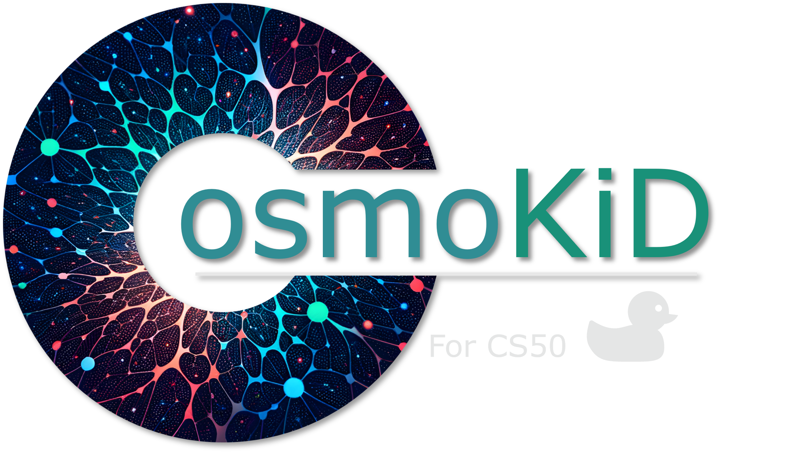

# CosmoKiD

Welcome to CosmoKiD, a fun toy educational mini Astro Webpage put together for young cosmic enthusiasts.



## Introduction
CosmoKiD is a toy project created as a final project for [CS50](https://pll.harvard.edu/course/cs50-introduction-computer-science), Harvard University's online course of Computer Science. It aims to provide a fun and engaging way for young learners to explore astronomy and the universe.

This project is also available online at [CosmoKiD](https://cosmokid.pythonanywhere.com/).

## Features
- **Astronomy vs Astrology**: Understand the difference between scientific astronomy and the belief system of astrology.
- **Our Solar System and Milky Way**: Learn about the planets, other celestial bodies, and our position in the Milky Way.
- **Light, Colors & Why the Sky is Blue**: Discover the science behind light, colors, and the blue sky.
- **Origin of Elements**: Explore how elements are formed in stars and supernovae.
- **Astronomy Picture of the Day (APOD)**: Enjoy daily images from NASA's APOD.

## Installation

1. **Clone the Repository**
   ```bash
   git clone https://github.com/forusovam46/CosmoKiD.git
   cd CosmoKiD
